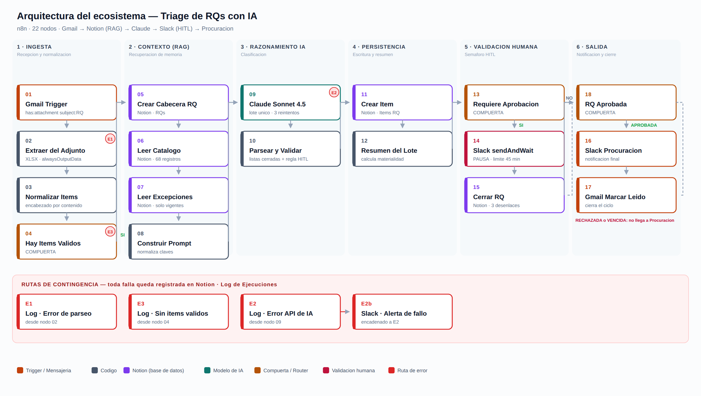

# Triage de Requisiciones con IA

Proyecto final del curso de Automatización con IA · Coderhouse

Sistema que recibe requisiciones de un subcontratista por correo, clasifica cada ítem contra el catálogo histórico, las excepciones vigentes y el glosario del contrato, y determina quién paga cada insumo. Antes de notificar a Procuración, el flujo se detiene y pide autorización en Slack para los ítems sin respaldo suficiente o de monto alto.

Caso de negocio: constructora mexicana con dos contratos de operación integral de centros penitenciarios (CPS 15 Chiapas y CPS 16 Morelos) y un subcontratista, SIMCO, que presenta requisiciones de insumos, refacciones y servicios.



---

## Enlaces

| Recurso | Enlace |
| --- | --- |
| Repositorio | [github.com/Garcia95-HEX/Triage-de-RQs-con-IA](https://github.com/Garcia95-HEX/Triage-de-RQs-con-IA) |
| Documento de entrega (PDF) | [Entrega-Final-Ecosistema-IA.pdf](docs/Entrega-Final-Ecosistema-IA.pdf) |
| Base de datos en Notion (solo lectura) | [CODERHOUSE - ENTREGA FINAL](https://harvest-target-6cd.notion.site/CODERHOUSE-ENTREGA-FINAL-3e44817126d281a5b27bfb8af13a3ec8) |
| Dashboard de Control | [Dashboard de Control](https://harvest-target-6cd.notion.site/Dashboard-de-Control-3e74817126d28122b602defe712c97a5) |
| Video demostrativo | [evidencias/video-demo.mp4](evidencias/video-demo.mp4) |
| Flujo n8n | [flujo/flujo-triage-rq.json](flujo/flujo-triage-rq.json) |

---

## Contenido del repositorio

```
.
├── README.md
├── docs/
│   └── Entrega-Final-Ecosistema-IA.pdf   Documento completo: arquitectura, datos, costos, seguridad, dashboard y pruebas
├── flujo/
│   └── flujo-triage-rq.json              Exportación del workflow de n8n (22 nodos, sin credenciales)
├── diagrama/
│   ├── diagrama-arquitectura.png
│   └── diagrama-arquitectura.svg
├── pruebas/
│   └── RQ-03xx_SIMCO_*.xlsx              Archivos de entrada de las ejecuciones de prueba
└── evidencias/
    ├── video-demo.mp4                    Video demostrativo de 3 minutos
    └── *.png                             Capturas de ejecuciones, Slack, Notion y dashboard
```

---

## Cómo funciona

| Etapa | Nodos | Qué hace |
| --- | --- | --- |
| Ingesta | 01–04 | Gmail Trigger con filtro `has:attachment subject:RQ`. Extrae las filas del Excel, localiza el encabezado por contenido y corta si no hay ítems legibles. |
| Contexto | 05–08 | Crea la cabecera en Notion, recupera el catálogo (68 insumos) y las excepciones confirmadas, y arma un solo payload. |
| Clasificación | 09–10 | Claude Sonnet 4.5 clasifica el lote completo en una llamada. El nodo 10 valida la salida contra listas cerradas y aplica la regla de escalamiento. |
| Persistencia | 11–12 | Escribe cada ítem en Notion con su fuente, confianza y justificación, y calcula el resumen del lote. |
| Validación humana | 13–15 | Si hay ítems detenidos, Slack `sendAndWait` suspende la ejecución hasta que alguien autoriza o rechaza. Límite de 45 minutos. |
| Salida | 18, 16, 17 | Solo una RQ aprobada se notifica a Procuración. El correo se marca como leído. |
| Contingencia | E1, E2, E2b, E3 | Toda falla o rechazo queda en el Log de Ejecuciones. Una falla de la API de Claude también alerta en Slack. |

### Regla de escalamiento

| Señal | Comportamiento |
| --- | --- |
| Fuente = Investigación o Requiere criterio | Siempre a revisión humana |
| Confianza baja | Siempre a revisión humana |
| Confianza media | A revisión si el importe es de $10,000.00 MXN o más |
| Confianza alta | Automático |

---

## Stack

| Componente | Herramienta |
| --- | --- |
| Orquestador | n8n Cloud |
| Base de datos | Notion (5 bases relacionadas) |
| Modelo de IA | Claude Sonnet 4.5, vía créditos gestionados de n8n |
| Canal de salida y validación humana | Slack |
| Entrada | Gmail |

---

## Resultados de las pruebas

Siete ejecuciones, con corte al 25 de septiembre de 2026.

| # | Folio | Ítems | Desenlace |
| --- | --- | --- | --- |
| 1 | RQ-0313 | 9 | Aprobada · 7 automáticos, 2 a revisión |
| 2 | RQ-0314 | 6 | Aprobada · sin revisión |
| 3 | RQ-0315 | 0 | Rechazada · encabezado sin descripción |
| 4 | RQ-0316 | 6 | Aprobada · excepción aplicada, contrato leído del archivo |
| 5 | RQ-0320 | 6 | Aprobada · 4 automáticos, 2 a revisión |
| 6 | RQ-0317 | 6 | Rechazada por humano, sin notificar a Procuración |
| 7 | RQ-0318 | 0 | Rechazada · adjunto ilegible |

| Indicador | Valor |
| --- | --- |
| Ítems clasificados | 42 |
| Tasa de automatización | 73.8% |
| Monto detenido en validación humana | $360,100.00 de $665,460.00 MXN (54.1%) |
| Fallas del sistema | 0 |
| Costo del modelo por requisición | $0.0197 USD |

Durante las pruebas se corrigieron diez defectos. El detalle está en la sección 8 del PDF.

---

## Criterios de evaluación

| Criterio | Dónde se cubre |
| --- | --- |
| Mapa de arquitectura | PDF, sección 3 · carpeta `diagrama/` |
| Estructuras de datos documentadas | PDF, sección 4 |
| Optimización de costos | PDF, sección 5 |
| Seguridad y resiliencia | PDF, sección 6 |
| Dashboard de control | PDF, sección 7 · enlace público en la tabla de Enlaces |

---

## Reproducir el flujo

1. Importar `flujo/flujo-triage-rq.json` en n8n (menú Workflows → Import from File).
2. Crear las credenciales de Gmail, Notion y Slack, y asignarlas a los nodos correspondientes. El nodo de Claude usa los créditos gestionados de n8n; con una cuenta propia de Anthropic hay que agregar la credencial.
3. Duplicar la página de Notion y compartirla con la integración de n8n. Actualizar los IDs de las cinco bases en los nodos 05, 06, 07, 11, 15 y E1–E3.
4. Crear el canal de Slack y actualizar su ID en los nodos 14, 16 y E2b.
5. Activar el workflow y después enviar un correo con asunto `RQ-XXXX` y uno de los archivos de `pruebas/` como único adjunto. El trigger solo toma correos recibidos después de la activación.

---

## Limitaciones conocidas

- El flujo no deduplica por folio. Reenviar el mismo correo crea una segunda cabecera.
- Las relaciones `Match Catálogo` y `Excepción aplicada` no se escriben automáticamente; la referencia queda como texto en la justificación.
- Los ítems detenidos no tienen un cierre automático después de la autorización del lote.
- La ruta de vencimiento del plazo de validación está implementada pero no se ejercitó.
- El riesgo de instrucciones inyectadas en la descripción de un ítem está mitigado de forma parcial (ver sección 6 del PDF, apartado 5.1).
- El dashboard usa tablas en lugar de gráficas por el límite de una gráfica por espacio de trabajo del plan gratuito de Notion.

---

Autor: Agustín García · Septiembre 2026
